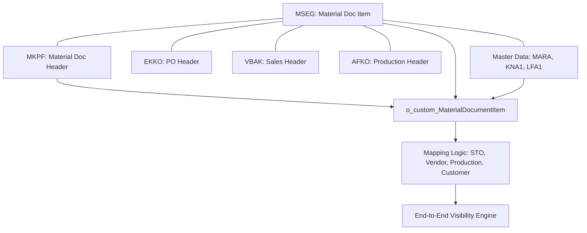

# SCNV SAP Data & Mapping Guide

This document is a comprehensive technical reference for junior developers working on the SCNV (Supply-Chain Network Visibility) prototype. It details the SAP tables, their internal relationships, and how they map to the visibility engine.

## 1. Data Architecture Overview

SCNV uses a **Unified Material Document View** approach. Instead of querying 30 different SAP tables in real-time, the system builds a central transactional hub ($`o_custom_MaterialDocumentItem`$) by joining material documents with their associated headers and master data.

---

## 2. SAP Table Reference (Data Dictionary)

### **A. Core Inventory & Transactions**
| Table | Technical Name | Key Fields to Know | Role in SCNV |
|-------|----------------|----------|--------------|
| **MSEG** | Material Document Item | `MBLNR`, `MJAHR`, `ZEILE`, `MATNR`, `WERKS`, `CHARG`, `BWART` | The primary source of truth for all physical stock moves. |
| **MKPF** | Material Document Header| `MBLNR`, `MJAHR`, `BUDAT` (Posting Date), `USNAM` | Provides the "When" and "Who" for stock moves. |
| **MCHA** | Batches | `MATNR`, `WERKS`, `CHARG` (Batch), `VFDAT` (Shelf Life) | Tracks the "Golden Thread" (Batch Number) across plants. |
| **ZPI_BATCH_CHGS** | Batch Transformation | `CHARG_OLD`, `MATNR_OLD`, `CHARG_NEW`, `MATNR_NEW` | Special table for **Mother-to-Child** batch relationships. |

### **B. Purchasing & Inbound (Vendor / STO)**
| Table | Technical Name | Key Fields to Know | Role in SCNV |
|-------|----------------|----------|--------------|
| **EKKO** | Purchasing Header | `EBELN` (PO #), `LIFNR` (Vendor), `BEDAT` (Order Date) | Defines the contract for Inbound or STO moves. |
| **EKPO** | Purchasing Item | `EBELN`, `EBELP` (Item #), `MATNR`, `WERKS` | Specific material/quantity expected from a vendor. |
| **LFA1** | Vendor Master | `LIFNR`, `NAME1`, `LAND1` (Country) | Source of vendor location and name. |

### **C. Sales & Outbound (Customer)**
| Table | Technical Name | Key Fields to Know | Role in SCNV |
|-------|----------------|----------|--------------|
| **VBAK** | Sales Header | `VBELN` (Sales Order), `KUNNR` (Customer), `AUDAT` | Defines the destination for outbound visibility. |
| **VBAP** | Sales Item | `VBELN`, `POSNR`, `MATNR`, `NETWR` (Value), `KWMENG` (Qty) | Tracks specific line items sent to customers. |
| **KNA1** | Customer Master | `KUNNR`, `NAME1`, `LAND1`, `WERKS` (Customer Plant) | Source of customer location and type info. |
| **LIKP** | Delivery Header | `VBELN` (Delivery #), `LFART` (Type), `WADAT_IST` (PGI Date)| Bridges the Sales Order to the physical move. |

### **D. Production (Manufacturing)**
| Table | Technical Name | Key Fields to Know | Role in SCNV |
|-------|----------------|----------|--------------|
| **AFKO** | Production Order | `AUFNR` (Order #), `GLTRS` (Finish), `GSTRS` (Start) | Links Raw Materials (261) to Finished Goods (101). |

---

## 3. Join Relationships (Join Keys)

When writing SQL for SCNV, use these standardized join keys:

1.  **Material Documents**: 
    `MSEG.MBLNR = MKPF.MBLNR` AND `MSEG.MJAHR = MKPF.MJAHR`
2.  **Purchase Orders**: 
    `MSEG.EBELN = EKKO.EBELN` (Header) / `MSEG.EBELN = EKPO.EBELN AND MSEG.EBELP = EKPO.EBELP` (Item)
3.  **Sales Orders**: 
    `LIPS.VGBEL = VBAP.VBELN` AND `LIPS.VGPOS = VBAP.POSNR`
4.  **Production**: 
    `MSEG.AUFNR = AFKO.AUFNR`
5.  **Master Data**:
    `MSEG.MATNR = MARA.MATNR` (Material)
    `EKKO.LIFNR = LFA1.LIFNR` (Vendor)
    `VBAK.KUNNR = KNA1.KUNNR` (Customer)

---

## 4. Visibility Mapping Logic

SCNV works by "stitching" batches together using the following movement types ($`BWART`$):

| Process | Move Codes | Logic Summary |
|---------|------------|---------------|
| **Vendor Inbound** | `101` | Links Vendor to a New Batch in the Warehouse. |
| **STO Transfer** | `641` $\to$ `101` | Links Batch X leaving Plant A to Batch X arriving at Plant B. |
| **Production** | `261` $\to$ `101` | Links Raw Batch (input) to Finished Batch (output) via Order. |
| **Batch Split** | `ZPI_BATCH_CHGS` | Links a Mother Batch to one or more Child Batches. |
| **Customer Sale** | `601` | Marks the end of visibility as the Batch leaves for a Customer. |

## 5. SAP Glossary for Beginners

| Term | Full Name | Meaning |
|------|-----------|---------|
| **WERKS** | Werk | **Plant** (Factory or Warehouse). |
| **MATNR** | Materialnummer | **Material Number** (The Product ID). |
| **CHARG** | Charge | **Batch Number** (The Lot ID). |
| **BWART** | Bewegungsart | **Movement Type** (The action: 101=Receipt, 261=Issue). |
| **LIFNR** | Lieferantennummer | **Vendor Number**. |
| **KUNNR** | Kundennummer | **Customer Number**. |
| **MANDT** | Mandant | **Client** (Usually 100, 200, etc. - separates environments). |
| **EBELN** | Einkaufsbeleg | **Purchase Order Number**. |
| **VBELN** | Vertriebsbeleg | **Sales Order/Delivery Number**. |
| **AUFNR** | Auftragsnummer | **Production Order Number**. |

## 6. Junior Developer "Rules"
1.  **Always use Batch Numbers**: If a join doesn't include $`CHARG`$, you are probably losing granularity.
2.  **Check Movement Indicators**: In MSEG, `SHKZG = 'S'` is a Debit (Receipt), `SHKZG = 'H'` is a Credit (Issue).
3.  **Validate against o_custom**: Before writing a new query, check if the data already exists in the unified `o_custom_MaterialDocumentItem` view.
